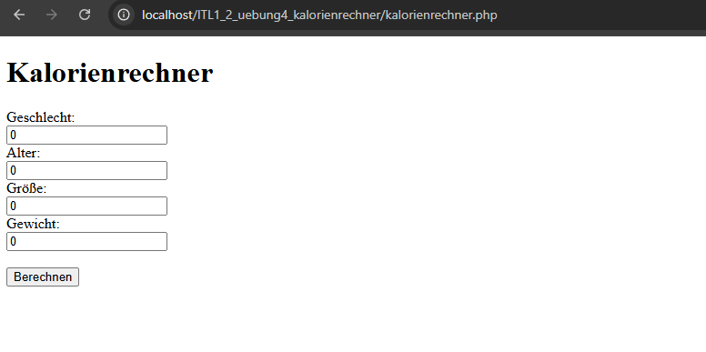
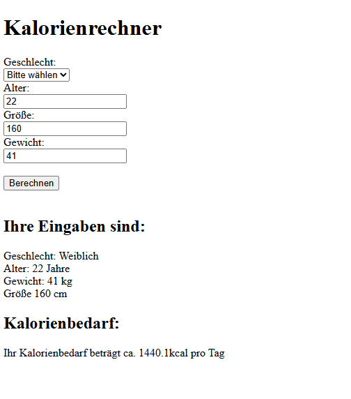

Übung 4 - Kalorienrechner
Author: Schloffer Lisa 
20225/26

## Umsetzung

1. Zu Beginn habe ich erstmal die Eingabe Felder wieder erstellt.

2. Dann habe ich die Kalorienbedarf-Rechnungen gemacht und eine Ausgabe dafür.

