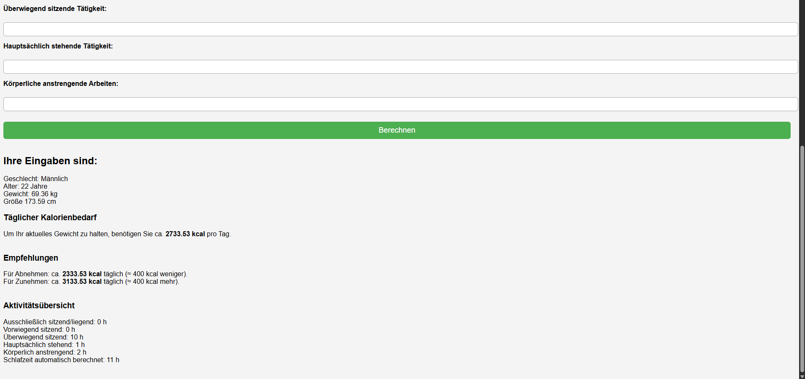
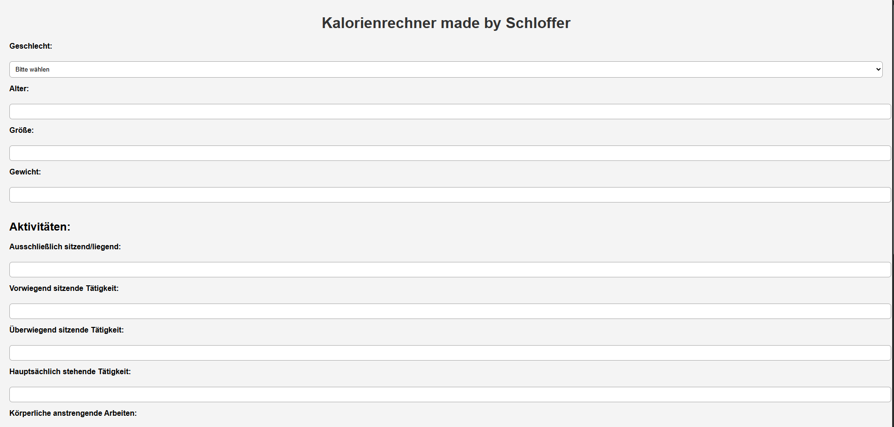

Übung 4 - Kalorienrechner
Author: Schloffer Lisa 
20225/26

## Umsetzung

1. Zu Beginn habe ich erstmal die Eingabe Felder wieder erstellt.

2. Dann habe ich die Kalorienbedarf-Rechnungen gemacht und eine Ausgabe dafür.

3. Dann ging es darum die Aktivitäten, deren PAL Faktoren und den Rechner einzubauen.

4. Zum Schluss habe ich noch das Design mit css angepasst.

